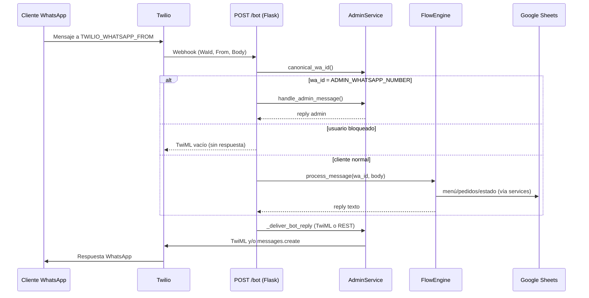
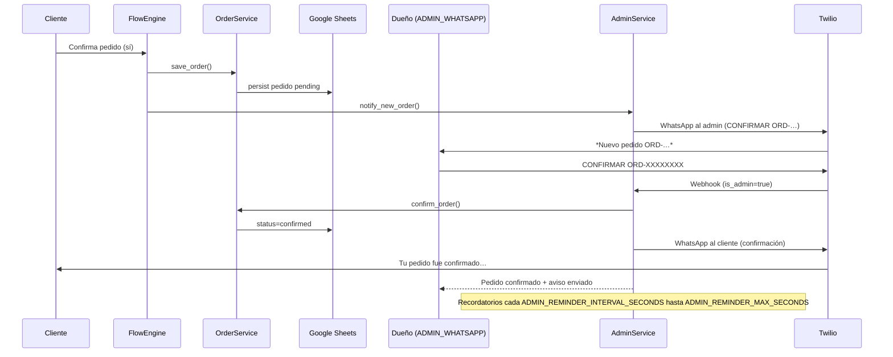
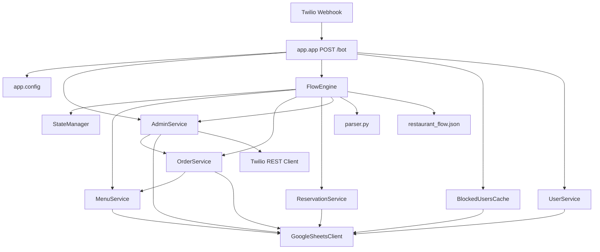

## Primer prompt

@PROMPTS_LISTOS.md (58-79) 

## Res prompt ##

# Fase 0 — Análisis WhatsBot (sin cambios en código)

Análisis del bot Python en la raíz. **No se creó ni modificó `final_system/`.**

---

## 1. Inventario de archivos

| Archivo / carpeta | Propósito | ¿Chatbot? | Destino `final_system` | Acción |
|-------------------|-----------|-----------|------------------------|--------|
| `app/app.py` | Flask: webhook Twilio `POST /bot`, health, entrega TwiML/REST | **Sí** | `api/routes/whatsapp.py` + `chatbot/gateway.py` | Envolver en gateway; no reescribir lógica |
| `app/config.py` | Carga `.env`, Twilio, Sheets, TTLs, rutas | **Sí** | `config/settings.py` + `.env` | Migrar variables; defaults en `config/*` |
| `app/core/flow_engine.py` | Motor conversacional JSON (pedido/reserva) | **Sí** | `chatbot/` (caja negra) | Copiar intacto |
| `app/core/parser.py` | NLU pedidos + intents globales | **Sí** | `chatbot/` | Copiar intacto |
| `app/core/state_manager.py` | Estado por `wa_id` (JSON en disco) | **Sí** | `chatbot/` → luego BD | Fase 2–5 |
| `app/services/admin_service.py` | Admin WhatsApp, Twilio outbound, confirmación | **Sí** | `chatbot/` + `notification_service` | Mantener flujo legacy |
| `app/services/order_service.py` | Pedidos (Sheets) | **Sí** | `chatbot/` + models `order` | Copiar; BD en Fase 5+ |
| `app/services/menu_service.py` | Menú formateado | **Sí** | `chatbot/` | Copiar |
| `app/services/user_service.py` | Perfiles usuario | **Sí** | `chatbot/` | Copiar |
| `app/services/reservation_service.py` | Reservas | **Sí** | `chatbot/` | Copiar |
| `app/services/blocked_users_cache.py` | Cache usuarios bloqueados | **Sí** | `chatbot/` | Copiar |
| `app/integrations/google_sheets.py` | Fuente de datos + cachés locales | **Sí** | `chatbot/` + sync opcional | Sheets no bloqueante en SaaS |
| `app/utils/validators.py` | Confirmaciones admin/cliente, fechas | **Sí** | `chatbot/` | Copiar |
| `app/utils/client_message_log.py` | Log async de mensajes cliente | **Sí** | BD `message` + opcional log | Reemplazar por persistencia API |
| `flows/restaurant_flow.json` | Nodos, mensajes, comandos globales | **Sí** | BD por negocio (semilla desde defaults) | No editar algoritmo; migrar contenido |
| `.env` / `.env.example` | Secrets y tuning | Config | `final_system/.env` | Copiar valores reales en Fase 1 (gitignore) |
| `credentials/google-service-account.json` | Service account Google | Config | `credentials/` o `GOOGLE_SERVICE_ACCOUNT_JSON` | Copiar archivo o JSON en env (Render) |
| `run.py` | Entry producción (waitress) | Infra | `api/main.py` o equivalente | Sustituir por FastAPI + uvicorn |
| `runall.py` | Lanza servidor en ventana CMD (dev Win) | No | — | Solo dev local |
| `requirements.txt` | Deps Python | Infra | `requirements.txt` nuevo | Ampliar (FastAPI, SQLAlchemy, etc.) |
| `Dockerfile` | Imagen producción | Infra | `final_system/Dockerfile` | Adaptar árbol |
| `railway.toml` / `render.yaml` | Deploy cloud | Infra | Docs deploy | Mantener referencia |
| `data/*.json` | Cachés Sheets + `user_states.json` | Datos runtime | PostgreSQL + Redis opcional | Migrar estado a BD |
| `data/parser_errors.jsonl` | Auditoría parser/admin | Observabilidad | Logs/BD opcional | Opcional |
| `client_messages_log/` | Logs texto de conversaciones | No (debug) | — o export | No crítico producción |
| `scripts/*.py` | Tests, benchmarks, verify deploy | No | `scripts/` en `final_system` | Portar `validate_chatbot.py` en Fase 2 |
| `README.md`, `PROMPT_*.md`, `PROMPTS_LISTOS.md` | Docs / prompts maestro | No | `docs/` | Referencia |
| `venv/` | Entorno local | No | — | Ignorar |
| `dashboard/` | Vacío | No | — | Ignorar (prohibido panel web WhatsBot) |
| `guardar.py`, `pendientes.md`, `PRECIOS.md`, etc. | Auxiliares / notas | No | — | Revisar caso a caso |

---

## 2. Diagramas Mermaid

### Flujo cliente (mensaje → respuesta)

### Flujo confirmación `ADMIN_WHATSAPP_NUMBER`

---

## 3. Mapa de credenciales (sección 1.b del maestro)

Valores leídos en disco; en chat solo máscaras. **No hay JWT ni BD en el legacy.**

| Variable legacy | Dónde está | Variable `final_system/.env` | Obligatoria |
|-----------------|------------|------------------------------|-------------|
| `TWILIO_ACCOUNT_SID` | `.env`, `app/config.py`, `render.yaml` | `TWILIO_ACCOUNT_SID` | **Sí** |
| `TWILIO_AUTH_TOKEN` | `.env`, `app/config.py` | `TWILIO_AUTH_TOKEN` | **Sí** |
| `TWILIO_WHATSAPP_FROM` | `.env` (`whatsapp:+57…`) | `TWILIO_WHATSAPP_FROM` + `business.twilio_whatsapp_from` | **Sí** |
| `ADMIN_WHATSAPP_NUMBER` | `.env` | `ADMIN_WHATSAPP_NUMBER` + `business.admin_whatsapp_number` | **Sí** (confirmación legacy) |
| `GOOGLE_SHEETS_CREDENTIALS_PATH` | `.env` → `credentials/google-service-account.json` | `GOOGLE_SERVICE_ACCOUNT_JSON_PATH` o JSON inline | **Sí** si Sheets activo |
| `GOOGLE_SPREADSHEET_ID` | `.env` | `GOOGLE_SHEET_ID_*` / `GOOGLE_SPREADSHEET_ID` | **Sí** hoy (fuente datos) |
| `GOOGLE_SERVICE_ACCOUNT_JSON` | `.env.example` (Render); `google_sheets.py` | `GOOGLE_SERVICE_ACCOUNT_JSON` | Opcional (cloud) |
| `SECRET_KEY` | `.env` | `JWT_SECRET_KEY` o `FLASK_SECRET` | Opcional legacy; **Sí** en SaaS (JWT) |
| `RESTAURANT_NAME` | `.env` | `business.name` default | Opcional |
| `STATE_PERSIST_PATH` | `.env` | Reemplazado por BD | Opcional (dev) |
| `HOST` / `PORT` | Default `run.py` (`0.0.0.0` / `5000`) | `HOST`, `PORT` | Opcional |
| `TWILIO_REST_WEBHOOK_REPLIES` | `.env` (`0`) | Misma o lógica en gateway | Opcional |
| `MENU_CACHE_TTL_SECONDS`, `ORDERS_*`, `BLOCKED_*`, `SHEETS_*` | `.env` | `config/settings.py` / env | Opcional |
| `ADMIN_REMINDER_*` | `.env` | `config/bot_config.py` | Opcional |
| `PARSER_ERROR_LOG_PATH` | `.env` | Logs / observabilidad | Opcional |
| `DEPLOY_URL` | `scripts/verify_deployment.py` (default `http://127.0.0.1:5000`) | **`API_PUBLIC_URL`** | **Sí** para Flutter/webhook |
| Webhook Twilio | README: `POST …/bot` (ngrok/Render/Railway) | `API_PUBLIC_URL` + ruta `/webhook` | **Sí** en producción |
| `DATABASE_URL` | **No existe** | `postgresql://…` | **Sí** (nuevo SaaS) |
| `REDIS_URL` | **No existe** (mención futura en README) | `redis://…` | Opcional |
| `JWT_SECRET_KEY` / `JWT_EXPIRE_MINUTES` | **No existe** | Nuevas en maestro | **Sí** para WhatsBot app |

**Valores detectados (enmascarados):** Twilio SID `AC***…841a`, token `***`, bot `whatsapp:+57324***7352`, admin `whatsapp:+57300***1032`, spreadsheet ID `110z***RYg`, credenciales en `credentials/google-service-account.json`.

**Puerto / URL pública:** local `http://0.0.0.0:5000`; webhook documentado `POST /bot`; producción vía Docker + Render/Railway (sin URL fija en repo — usar `DEPLOY_URL` del hosting o ngrok en dev).

---

## 4. Riesgos de migración

| RIESGO | IMPACTO | MITIGACIÓN |
|--------|---------|------------|
| Romper `POST /bot` al mover a FastAPI/gateway | Clientes sin respuesta | Gateway único; tests `validate_chatbot.py`; mantener contrato Twilio |
| `ADMIN_WHATSAPP` = `TWILIO_WHATSAPP_FROM` | Admin tratado como cliente | Validación al arranque (ya existe); checklist deploy |
| Google Sheets como única fuente de verdad | Pérdida pedidos/menú si Sheets falla | PostgreSQL fuente de verdad; Sheets opcional (`GOOGLE_SHEETS_ENABLED=false`) |
| Estado en `user_states.json` (archivo) | Pérdida sesión multi-instancia | Migrar a BD/Redis; Fase 5+ |
| Normalización E.164 incorrecta | Error Twilio 63024, admin no recibe alertas | Reutilizar `AdminService.canonical_wa_id` sin reescribir |
| Límite diario Twilio 63038 | Sin respuestas REST ni TwiML útil | Monitoreo; flag `TWILIO_REST_WEBHOOK_REPLIES` |
| Reescribir intents/parser | Regresión NLU | Regla maestro: copiar caja negra, no reescribir |
| Secrets en chat/commits | Filtración | Solo `***` en chat; `.env` en gitignore |
| Confundir WhatsBot con web | Producto incorrecto | Solo Flutter Android/iOS; `dashboard/` vacío ignorado |

---

## 5. Entry points

| Archivo | Función / ruta | Rol |
|---------|----------------|-----|
| `run.py` | `__main__` → `waitress.serve(app)` | **Producción** (Docker CMD) |
| `app/app.py` | `create_app()` | Factory Flask + wiring servicios |
| `app/app.py` | `POST /bot` → `bot_webhook()` | **Webhook Twilio principal** |
| `app/app.py` | `GET /health` | Health check (Render/Railway) |
| `app/app.py` | `POST /bot/reload-flow` | Recarga `restaurant_flow.json` |
| `app/app.py` | `if __name__ == "__main__"` | Dev directo waitress |
| `runall.py` | `run_server()` / subprocess CMD | Dev Windows |
| `scripts/diagnose_twilio_whatsapp.py` | `main()` | Diagnóstico Twilio |
| `scripts/verify_admin_flow.py` | tests admin sin red | QA |
| `scripts/verify_deployment.py` | `main()` | Verifica `/health` y `/bot` en `DEPLOY_URL` |

---

## 6. Ubicación de intents, textos, Twilio, Sheets

| Concepto | Ubicación |
|----------|-----------|
| **Intents globales (menu/pedido/reservar)** | `app/core/parser.py` → `GLOBAL_COMMAND_INTENTS`, `infer_user_intent()` |
| **Comandos globales (config)** | `app/config.py` → `GLOBAL_COMMANDS` |
| **Routing por nodo** | `flows/restaurant_flow.json` → `meta.global_commands`, `nodes.*.options` |
| **Orquestación intents** | `app/core/flow_engine.py` → `process_message()`, routing por `infer_user_intent` |
| **Textos al usuario** | `flows/restaurant_flow.json` (`message`, `message_secondary`); plantillas `{{restaurant_name}}` en `flow_engine._render()`; `RESTAURANT_NAME`, `NAV_HINT` en `config.py` |
| **Textos admin** | `admin_service.py` → `notify_new_order()`, recordatorios, respuestas `handle_admin_message()` |
| **Confirmación admin** | `app/utils/validators.py` → `is_admin_confirm()`, `extract_admin_order_id()` |
| **Twilio inbound** | `app/app.py` → `bot_webhook()` (parse form Twilio) |
| **Twilio outbound** | `admin_service.py` → `_send_whatsapp()`; entrega respuesta cliente: `_deliver_bot_reply()` + `_use_rest_webhook_replies()` |
| **Google Sheets** | `app/integrations/google_sheets.py`; credenciales `credentials/google-service-account.json`; ID en `GOOGLE_SPREADSHEET_ID`; cachés en `data/*_cache.json` |

---

## 7. Grafo de dependencias (15 nodos clave)

**Cadena crítica pedido:** `FlowEngine._action_save_order` → `OrderService.save_order` → `GoogleSheetsClient` → `AdminService.notify_new_order` → Twilio → admin.

---

## Resumen técnico

| Aspecto | Estado actual |
|---------|----------------|
| Stack | Flask + Waitress + Twilio + gspread |
| Persistencia | Google Sheets + JSON local (`data/`, `user_states.json`) |
| Multi-negocio | No (un restaurante por `.env`) |
| BD / JWT / Redis | No implementados |
| `final_system/` | No existe (correcto para Fase 0) |
| WhatsBot objetivo | Flutter móvil (UI WhatsApp), no web |

---

**¿Procedo con la Fase 1?** (scaffold `final_system/`, `.env.example`, copia adaptada de credenciales del legacy — sin avanzar hasta tu **Sí**.)

#################################################