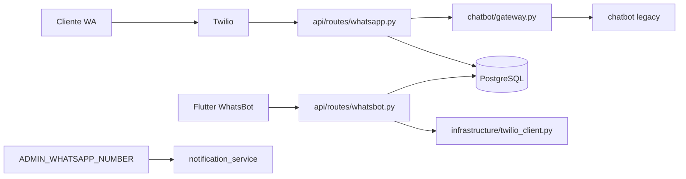

# Arquitectura WhatsBot SaaS (borrador — Fase 1)

## Estado actual

| Componente | Ubicación hoy | Ubicación objetivo |
|------------|---------------|-------------------|
| Chatbot WhatsApp | **Raíz** `app/` + `run.py` | `final_system/chatbot/` (caja negra + gateway) |
| Config | Raíz `app/config.py` | `final_system/config/*` |
| API REST | No existe | `final_system/api/` (FastAPI) |
| App dueño | No existe | `final_system/whatsbot_app/` (Flutter móvil) |
| Persistencia | JSON + Google Sheets | PostgreSQL (+ Sheets opcional) |

## Modelo de números

```
Cliente     → TWILIO_WHATSAPP_FROM (línea del bot del negocio)
Dueño       → App Flutter WhatsBot (JWT, mismo negocio)
Dueño       → ADMIN_WHATSAPP_NUMBER (confirmación legacy, se mantiene)
```

## Flujo objetivo (post Fase 10)



## Capas `final_system/`

1. **config/** — Máx. 5 archivos editables por desarrollador; defaults globales.
2. **chatbot/** — Única puerta: `handle_incoming_message()`; no reescribir parser/flow.
3. **api/** — JSON para Flutter; webhook Twilio.
4. **services/** — Negocio, menú, pedidos, conversaciones, notificaciones.
5. **infrastructure/** — BD, cache, Twilio.
6. **whatsbot_app/** — UI clon WhatsApp (Android/iOS); **no web**.

## Prohibiciones

- No UI web para WhatsBot (React/Vue/panel HTML como producto principal).
- No sustituir la app móvil por “solo API documentada”.
- Terminología nueva: `business` / `negocio`, no `restaurant` en código nuevo.

## Credenciales

Todas en `final_system/.env` (migradas Fase 1 desde `.env` en raíz).  
Flutter solo conoce `API_PUBLIC_URL` — nunca `TWILIO_AUTH_TOKEN`.

## Próximas fases

Ver `INCREMENTAL_GUIDE.md`.
