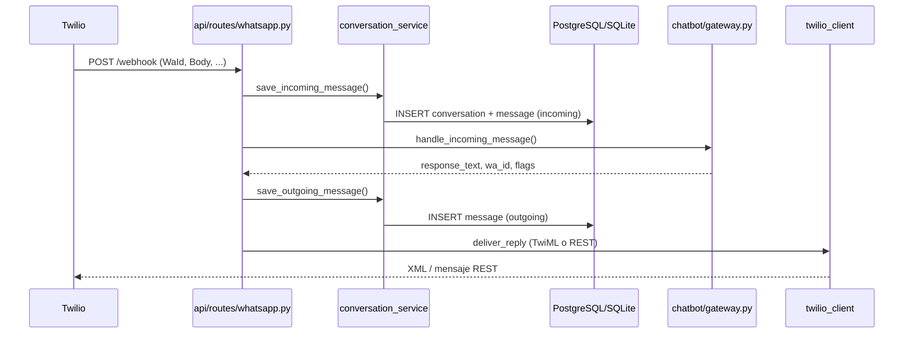

# Flujos WhatsApp

## Fase 4 — Webhook API

```mermaid
sequenceDiagram
    participant T as Twilio
    participant W as api/routes/whatsapp.py
    participant CS as conversation_service
    participant DB as PostgreSQL/SQLite
    participant G as chatbot/gateway.py
    participant TC as twilio_client

    T->>W: POST /webhook (WaId, Body, ...)
    W->>CS: save_incoming_message()
    CS->>DB: INSERT conversation + message (incoming)
    W->>G: handle_incoming_message()
    G-->>W: response_text, wa_id, flags
    W->>CS: save_outgoing_message()
    CS->>DB: INSERT message (outgoing)
    W->>TC: deliver_reply (TwiML o REST)
    TC-->>T: XML / mensaje REST
```

Rutas: `POST /webhook`, `POST /bot` (alias legacy).

Pedidos + admin legacy: **Fase 6** — `flows/restaurant_flow.json`, `admin_service`.
