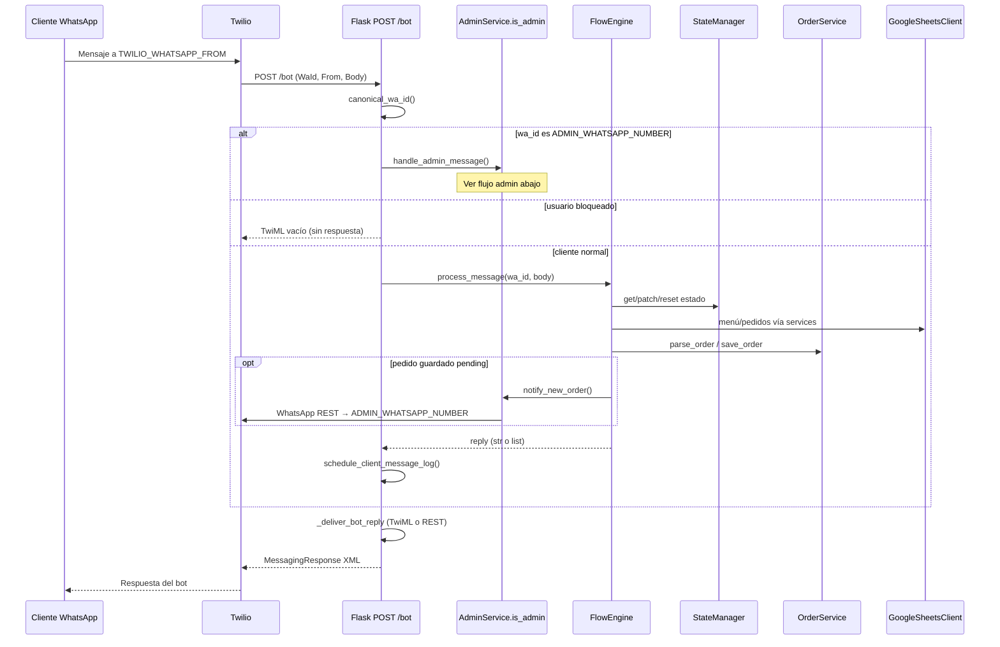
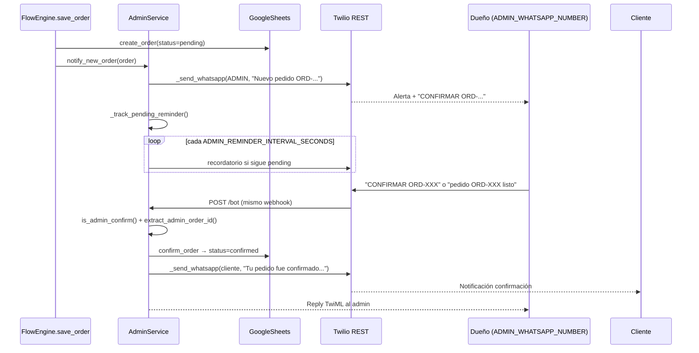
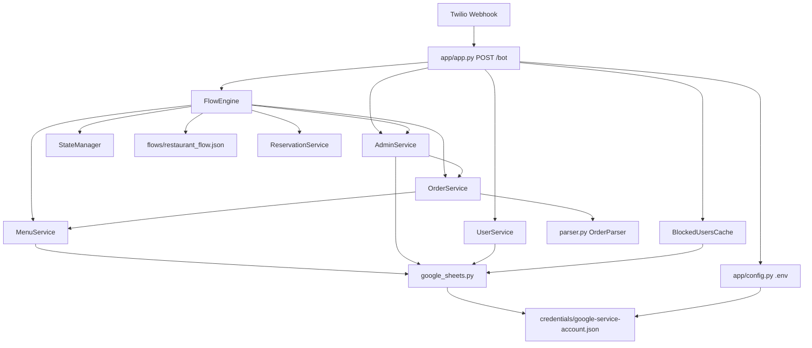
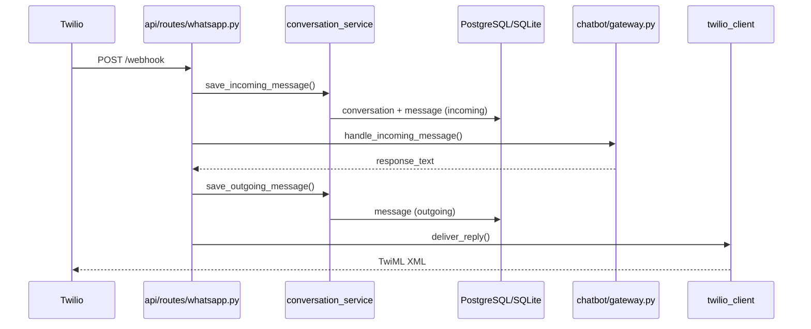
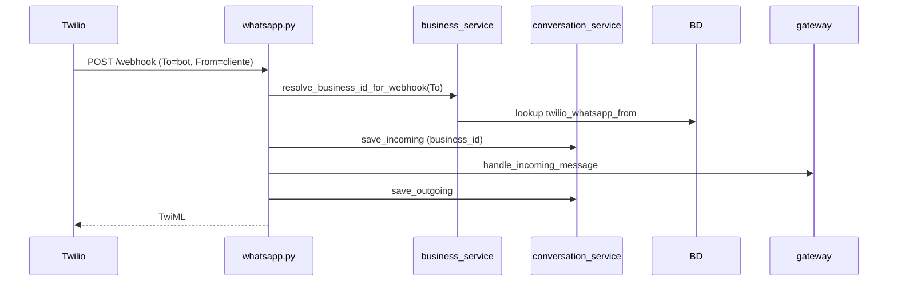

Aquí se irán pegando la respuesta de los prompts  de prompts_listos.md y cada versión será cada fase


## v0.00 @PROMPTS_LISTOS.md (40-50) Prompt 0 — Verificación al pegar el proyecto


## Verificación del proyecto WhatsBot

### 1. Código Python del bot
**Sí.** Hay un bot Flask en `app/` (webhook Twilio, parser, motor de flujo, servicios e integración con Google Sheets), más `run.py`, `runall.py` y scripts en `scripts/`. El núcleo está fuera de `venv/`.

### 2. Diez archivos clave
| # | Archivo | Rol |
|---|---------|-----|
| 1 | `app/app.py` | Flask + webhook `POST /bot` (Twilio WhatsApp) |
| 2 | `app/config.py` | Variables de entorno y rutas |
| 3 | `app/core/flow_engine.py` | Motor del flujo conversacional |
| 4 | `app/core/parser.py` | Parser NL de pedidos |
| 5 | `app/core/state_manager.py` | Estado por `WaId` |
| 6 | `app/integrations/google_sheets.py` | Google Sheets |
| 7 | `flows/restaurant_flow.json` | Flujo editable en JSON |
| 8 | `run.py` | Arranque del servidor (Waitress) |
| 9 | `requirements.txt` | Dependencias Python |
| 10 | `README.md` | Documentación de arquitectura e instalación |

### 3. Configuración y credenciales
| Recurso | ¿Existe? |
|---------|----------|
| `.env` | Sí |
| `.env.example` | Sí (plantilla) |
| JSON Google (service account) | Sí — `credentials/google-service-account.json` |

**Variables de entorno** (solo nombres, sin valores):

**Flask / servidor**
- `FLASK_ENV`
- `FLASK_DEBUG`
- `SECRET_KEY`
- `HOST`
- `PORT`

**Twilio / WhatsApp**
- `TWILIO_ACCOUNT_SID`
- `TWILIO_AUTH_TOKEN`
- `TWILIO_WHATSAPP_FROM`
- `TWILIO_REST_WEBHOOK_REPLIES`
- `ADMIN_WHATSAPP_NUMBER`

**Google Sheets**
- `GOOGLE_SHEETS_CREDENTIALS_PATH`
- `GOOGLE_SPREADSHEET_ID`
- `GOOGLE_SERVICE_ACCOUNT_JSON` (alternativa en nube; comentada en `.env.example`)

**Bot / caché / persistencia**
- `RESTAURANT_NAME`
- `STATE_PERSIST_PATH`
- `PARSER_ERROR_LOG_PATH`
- `MENU_CACHE_TTL_SECONDS`
- `ORDERS_CACHE_TTL_SECONDS`
- `BLOCKED_USERS_CACHE_TTL_SECONDS`
- `SHEETS_INCREMENTAL_THRESHOLD`
- `SHEETS_FULL_REFRESH_INTERVAL_SECONDS`
- `SHEETS_INCREMENTAL_BATCH_SIZE`

**Opcionales** (en `config.py` con defaults; no están en `.env.example`)
- `ADMIN_REMINDER_INTERVAL_SECONDS`
- `ADMIN_REMINDER_MAX_SECONDS`

**Scripts de despliegue** (opcionales)
- `DEPLOY_URL`
- `DEPLOY_TIMEOUT`

---

**Listo para Prompt 1 (Fase 0).**


#################################################
## v0.0 @PROMPTS_LISTOS.md (58-79)  Prompt 1 — Fase 0: Análisis (SIN tocar código)

# Fase 0 — Análisis (sin cambios en código)

Inventario completo del bot en la raíz. **No se creó `final_system/` ni se modificó ningún archivo.**

Recordatorio de producto: **WhatsBot = app Flutter móvil (UI tipo WhatsApp), no panel web.**

---

## 1. Tabla de archivos

| Archivo / carpeta | Propósito | ¿Chatbot? | Destino `final_system` | Acción |
|-------------------|-----------|-----------|------------------------|--------|
| `app/app.py` | Flask, webhook `POST /bot`, health, entrega TwiML/REST | **Sí** | `api/routes/whatsapp.py` + `chatbot/gateway.py` | Refactor Fase 2–4; no reescribir lógica |
| `app/config.py` | Carga `.env`, constantes Twilio/Sheets/caché | **Sí** | `config/settings.py` + `.env` | Migrar nombres; semilla defaults |
| `app/core/flow_engine.py` | Motor conversacional JSON | **Sí** | `chatbot/` (caja negra) | Copiar intacto vía gateway |
| `app/core/parser.py` | NL pedidos + `GLOBAL_COMMAND_INTENTS` | **Sí** | `chatbot/` | Copiar intacto |
| `app/core/state_manager.py` | Estado por `wa_id` + JSON disco | **Sí** | `chatbot/` → luego BD | Fase 5: persistir en PostgreSQL |
| `app/services/menu_service.py` | Menú (Sheets + caché) | **Sí** | `services/menu_service.py` | Multi-negocio + BD |
| `app/services/order_service.py` | Pedidos + parser carrito | **Sí** | `services/order_service.py` | Idem |
| `app/services/reservation_service.py` | Reservas | **Sí** | `services/` | Idem |
| `app/services/user_service.py` | Perfil cliente (Sheets) | **Sí** | `services/` | Idem |
| `app/services/admin_service.py` | Admin Twilio, confirmación, recordatorios | **Sí** | `services/notification_service.py` | Mantener legacy `ADMIN_WHATSAPP_NUMBER` |
| `app/services/blocked_users_cache.py` | Caché usuarios bloqueados | **Sí** | `services/` | Idem |
| `app/integrations/google_sheets.py` | Sheets + fallback demo + JSON local | **Sí** | `services/sheets_sync_service.py` | Opcional; no bloqueante |
| `app/utils/validators.py` | Confirmación admin, fechas, delivery | **Sí** | `chatbot/` | Copiar |
| `app/utils/client_message_log.py` | Log texto cliente/bot | **Sí** | `conversation_service` | Reemplazar por BD para Flutter |
| `flows/restaurant_flow.json` | Nodos, textos, `global_commands` | **Sí** | BD `business_config` + default en `config/` | Semilla al onboard; dueño edita en app |
| `run.py` | Entry producción Waitress | **Sí** | `api/main.py` (uvicorn) | Nuevo entry FastAPI |
| `runall.py` | Lanza servidor en CMD Windows | **Sí** | — | Solo dev legacy |
| `requirements.txt` | Deps Flask/Twilio/Sheets | **Sí** | `requirements.txt` ampliado | Añadir FastAPI, SQLAlchemy, JWT |
| `Dockerfile` | Imagen producción | **Sí** | `final_system/Dockerfile` | Actualizar para API |
| `railway.toml` / `render.yaml` | Deploy cloud | **Sí** | `final_system/` deploy | Migrar env vars |
| `.env` | Secrets runtime (*** configurado) | **Sí** | `final_system/.env` | Copiar valores reales Fase 1 (no en chat) |
| `.env.example` | Plantilla | **Sí** | `final_system/.env.example` | Ampliar con BD/JWT/API |
| `credentials/google-service-account.json` | Service account Google | **Sí** | Mismo path o `GOOGLE_SERVICE_ACCOUNT_JSON` | Copiar; gitignore |
| `data/*.json` | Cachés Sheets + `user_states.json` | Runtime | PostgreSQL + volúmenes | Migrar estado a BD |
| `data/parser_*.csv/md` | Benchmarks parser | No | `tests/` / `docs/` | Referencia QA |
| `scripts/*.py` | Stress, verify, diagnose | Parcial | `final_system/scripts/validate_*.py` | Reutilizar lógica de prueba |
| `client_messages_log/` | Logs manuales | No | — | Archivar; sustituir por BD |
| `README.md` | Doc + changelog masivo | No | `docs/` extractos | Referencia arquitectura |
| `PROMPT_*.md`, `PROMPTS_LISTOS.md` | Guías migración | No | — | Fuera del runtime |
| `AI_RULES.md`, `PRECIOS.md`, `pendientes.md`, `prompts.md` | Meta proyecto | No | — | No migrar |
| `guardar.py` | Git commit desde README | No | — | Ignorar |
| `dashboard/` (solo `__pycache__`) | Restos Django compilados | No | — | **No migrar** (sin fuente) |
| `venv/` | Entorno local | No | — | Ignorar |

---

## 2. Diagramas Mermaid

### Flujo cliente (webhook → respuesta)



### Flujo confirmación `ADMIN_WHATSAPP_NUMBER` (legacy)



---

## 3. Mapa de credenciales (sección 1.b)

Valores en disco verificados en `.env` y `credentials/`; en chat solo **\*\*\***.

| Variable legacy | Dónde está | Variable `final_system/.env` | Obligatoria | Estado legacy |
|-----------------|------------|------------------------------|-------------|---------------|
| `TWILIO_ACCOUNT_SID` | `.env`, `app/config.py`, `admin_service.py` | `TWILIO_ACCOUNT_SID` | **Sí** | Configurado *** |
| `TWILIO_AUTH_TOKEN` | `.env`, `app/config.py` | `TWILIO_AUTH_TOKEN` | **Sí** | Configurado *** |
| `TWILIO_WHATSAPP_FROM` | `.env`, `app/config.py` | `TWILIO_WHATSAPP_FROM` | **Sí** (línea bot clientes) | Configurado *** |
| `ADMIN_WHATSAPP_NUMBER` | `.env`, `app/config.py` | `ADMIN_WHATSAPP_NUMBER` | **Sí** (confirmación legacy) | Configurado *** |
| `TWILIO_REST_WEBHOOK_REPLIES` | `.env`, `app/app.py` | `TWILIO_REST_WEBHOOK_REPLIES` | Opcional (0=sandbox TwiML) | `0` |
| `GOOGLE_SHEETS_CREDENTIALS_PATH` | `.env`, `app/config.py` | `GOOGLE_SERVICE_ACCOUNT_JSON_PATH` | Opcional* | `credentials/google-service-account.json` |
| `GOOGLE_SERVICE_ACCOUNT_JSON` | `.env.example` (comentado), `google_sheets.py` | `GOOGLE_SERVICE_ACCOUNT_JSON` | Opcional (cloud) | No en `.env`; usa archivo |
| `GOOGLE_SPREADSHEET_ID` | `.env`, `app/config.py` | `GOOGLE_SHEET_ID_MENU` / unificar `GOOGLE_SPREADSHEET_ID` | Opcional* | Configurado *** |
| `RESTAURANT_NAME` | `.env`, `app/config.py` | Semilla `business.name` + default | Opcional | Configurado |
| `SECRET_KEY` | `.env` | `JWT_SECRET_KEY` (nuevo rol) | Opcional legacy; **Sí** SaaS | Placeholder |
| `FLASK_ENV` / `FLASK_DEBUG` | `.env` | `DEBUG` / eliminar | Opcional | development |
| `STATE_PERSIST_PATH` | `.env`, `app/config.py` | Reemplazado por BD | Legacy | `data/user_states.json` |
| `PARSER_ERROR_LOG_PATH` | `.env`, `app/config.py` | `PARSER_ERROR_LOG_PATH` o logs API | Opcional | Configurado |
| `MENU_CACHE_TTL_SECONDS` | `.env`, `app/config.py` | `MENU_CACHE_TTL_SECONDS` | Opcional | 60 |
| `ORDERS_CACHE_TTL_SECONDS` | `.env` | `ORDERS_CACHE_TTL_SECONDS` | Opcional | 30 |
| `BLOCKED_USERS_CACHE_TTL_SECONDS` | `.env` | Idem | Opcional | 15 |
| `SHEETS_INCREMENTAL_*` | `.env` | `config/sheets_config.py` | Opcional | Configurados |
| `ADMIN_REMINDER_INTERVAL_SECONDS` | `.env` (no en example) | Idem | Opcional | 300 |
| `ADMIN_REMINDER_MAX_SECONDS` | `.env` | Idem | Opcional | 3600 |
| `HOST` | `.env.example`, `run.py` | `HOST` | Opcional | Default `0.0.0.0` |
| `PORT` | `.env.example`, `run.py`, `Dockerfile` | `PORT` | Opcional | Default `5000` |
| `API_PUBLIC_URL` | **No existe**; README ngrok; `scripts` `DEPLOY_URL` | `API_PUBLIC_URL` | **Sí** para Flutter | Derivar: `https://<dominio>/` o ngrok `:5000` |
| `DEPLOY_URL` | `scripts/verify_deployment.py` | Alias documentación | Opcional dev | `http://127.0.0.1:5000` |
| `DATABASE_URL` | **No existe** | `postgresql://...` | **Sí** (nuevo SaaS) | Crear en Fase 1 |
| `REDIS_URL` | **No existe** | `redis://...` | Opcional | Crear si multi-instancia |
| `JWT_SECRET_KEY` | **No existe** | `JWT_SECRET_KEY` | **Sí** (WhatsBot app) | Generar Fase 1 |
| `JWT_EXPIRE_MINUTES` | **No existe** | `JWT_EXPIRE_MINUTES` | Opcional | Default 1440 |
| `GOOGLE_SHEETS_ENABLED` | **No existe** | `GOOGLE_SHEETS_ENABLED` | Opcional | `true` si hay spreadsheet |
| `CORS_ORIGINS` | **No existe** | `CORS_ORIGINS` | **Sí** para app móvil | `*` o dominios app |

\*Hoy Sheets + JSON local son fuente operativa; en SaaS pasan a espejo opcional (PostgreSQL = verdad).

**JWT / BD:** el bot legacy **no usa** base de datos ni JWT; todo es Flask + JSON + Google Sheets.

**OpenAI:** no referenciado en el código del bot.

**URL pública:** webhook Twilio = `POST {API_PUBLIC_URL}/bot` (README: ngrok `http 5000` → `https://<subdominio>.ngrok.io/bot`; producción Railway/Render).

---

## 4. Riesgos

| RIESGO | IMPACTO | MITIGACIÓN |
|--------|---------|------------|
| Reescribir `parser.py` / `flow_engine.py` | Regresión masiva en NL y flujos | Caja negra + `gateway.py`; copiar sin cambiar algoritmos (regla maestra #2) |
| Google Sheets como única fuente de verdad | Pérdida pedidos/menú si API Sheets cae | PostgreSQL fuente de verdad; `GOOGLE_SHEETS_ENABLED=false` debe funcionar |
| Estado en `data/user_states.json` | Sesiones rotas con 2+ instancias | Migrar a BD; volumen persistente en cloud |
| `ADMIN_WHATSAPP_NUMBER` = `TWILIO_WHATSAPP_FROM` | Admin nunca recibe comandos | Validación ya en `admin_service.py`; replicar en onboard |
| Twilio sandbox + `TWILIO_REST_WEBHOOK_REPLIES=0` | Producción con TwiML incorrecto | Detectar sandbox; documentar switch a REST |
| Secrets en repo / chat | Compromiso cuenta Twilio/Google | `.gitignore`; migrar a `final_system/.env`; rotar si expuestos |
| Confundir WhatsBot con dashboard web | Producto equivocado | Solo Flutter; `dashboard/` legacy ignorado |
| Webhook sin persistir mensajes | App Flutter vacía | Fase 4: guardar cada mensaje en `conversation`/`message` |
| Latencia sync Sheets en webhook | Timeouts Twilio | Mantener caché TTL; outbound admin ya síncrono en `notify_new_order` |
| Término `restaurant` en código/JSON | Deuda naming multi-negocio | Renombrar gradualmente a `business` en capa nueva |

---

## 5. Entry points

| Archivo | Función / ruta | Rol |
|---------|----------------|-----|
| `run.py` | `serve(app)` vía Waitress | **Producción principal** |
| `app/app.py` | `create_app()` → `app` | Factory Flask |
| `app/app.py` | `bot_webhook()` — `POST /bot` | **Webhook Twilio** |
| `app/app.py` | `health()` — `GET /health` | Healthcheck Railway/Render |
| `app/app.py` | `reload_flow()` — `POST /bot/reload-flow` | Hot-reload JSON flujo |
| `app/app.py` | `if __name__ == "__main__"` | Dev directo |
| `runall.py` | `run_server()` / `--serve` | Dev Windows |
| `Dockerfile` | `CMD ["python", "run.py"]` | Contenedor |
| `app/core/flow_engine.py` | `FlowEngine.process_message()` | Lógica conversacional cliente |
| `app/services/admin_service.py` | `handle_admin_message()` | Comandos dueño |
| `scripts/verify_deployment.py` | `main()` | Verificación deploy |
| `scripts/diagnose_twilio_whatsapp.py` | script | Diagnóstico Twilio |
| `scripts/simulate_conversation.py` | script | Simulación sin WhatsApp |

---

## 6. Ubicación de intents, textos, Twilio, Sheets

| Concern | Ubicación |
|---------|-----------|
| **Comandos globales (intents)** | `app/config.py` → `GLOBAL_COMMANDS`; `flows/restaurant_flow.json` → `meta.global_commands`; routing en `flow_engine._resolve_global_command()` |
| **Frases NL intents (menu/pedido/reservar/inicio/cancelar)** | `app/core/parser.py` → `GLOBAL_COMMAND_INTENTS`, `UserIntentClassifier`, `infer_user_intent()` |
| **Textos conversacionales (nodos)** | `flows/restaurant_flow.json` → `nodes.*.message`, `message_secondary`, `message_after_action`, `meta.cancel_message` |
| **Plantillas dinámicas** | `flow_engine._render()` + `RESTAURANT_NAME`, `NAV_HINT` en `app/config.py` |
| **Saludos / confirmación sí-no** | `app/utils/validators.py` → `GREETING_PHRASES`, `is_confirmation`, `is_admin_confirm` |
| **Twilio inbound** | `app/app.py` → `POST /bot` (form Twilio) |
| **Twilio outbound** | `app/services/admin_service.py` → `_send_whatsapp()` (REST Client); respuesta cliente vía TwiML o REST en `_deliver_bot_reply()` |
| **Google Sheets** | `app/integrations/google_sheets.py`; pestañas MENU/USERS/ORDERS/RESERVATIONS; credenciales path o `GOOGLE_SERVICE_ACCOUNT_JSON` |
| **Menú productos** | Sheets → caché `data/menu_cache.json` + `MenuService` |
| **Pedidos** | `OrderService` → `sheets.create_order` / `update_order_status` |

---

## 7. Grafo de dependencias (15 nodos clave)



---

## Hallazgos adicionales (Fase 0)

- **Stack:** Flask 3 + Waitress + Twilio + gspread; **sin** FastAPI, PostgreSQL, Redis, JWT, OpenAI.
- **Persistencia actual:** JSON en `data/` + Google Sheets; no hay ORM.
- **`dashboard/`:** solo bytecode; no hay fuente Django activo — **no es WhatsBot**.
- **`.env` real:** Twilio, Sheets y admin están poblados (valores **no** repetidos aquí).
- **Despliegue:** `Dockerfile`, `railway.toml`, `render.yaml` apuntan a `run.py` puerto **5000**, health `/health`.

---

¿Procedo con la **Fase 1** (scaffold `final_system/`, `.env` migrado desde legacy, sin tocar comportamiento del bot en raíz)? Responde **Sí** para continuar.


#################################################
## v0.2 Prompt 2 — Fase 1: Scaffold

## Fase 1 completada

Se creó `final_system/` según el prompt maestro. **El bot en la raíz no se modificó** (sin gateway, sin copia de `app/`).

### Creado

| Elemento | Detalle |
|----------|---------|
| **Árbol** | `config/`, `docs/`, `chatbot/` (vacío + README), `api/`, `services/`, `models/`, `infrastructure/`, `scripts/`, `tests/`, `whatsbot_app/` (solo README Fase 9) |
| **`config/*.py`** | 5 archivos con **GUÍA RÁPIDA** al final de cada uno |
| **`.env.example`** | Todas las variables del mapa Fase 0 |
| **`.env`** | Valores reales migrados desde raíz (Twilio, Admin, Sheets, cachés, recordatorios, `JWT_SECRET_KEY` ← `SECRET_KEY`, `DEFAULT_BUSINESS_NAME` ← `RESTAURANT_NAME`) |
| **Google** | `credentials/google-service-account.json` copiado; path en `.env` |
| **Docs** | `ARCHITECTURE.md`, `INCREMENTAL_GUIDE.md` (+ stubs WHATSAPP_FLOWS, FLUTTER_APP, guías) |
| **`requirements.txt`**, **`.gitignore`**, **`README.md`** | Listos |

### Mapeo legacy → `final_system/.env` (solo nombres)

- `GOOGLE_SHEETS_CREDENTIALS_PATH` → `GOOGLE_SERVICE_ACCOUNT_JSON_PATH`
- `RESTAURANT_NAME` → `DEFAULT_BUSINESS_NAME` (+ legacy name conservado en valor)
- `SECRET_KEY` → `JWT_SECRET_KEY` (mismo valor)
- Nuevos (sin legacy): `API_PUBLIC_URL`, `DATABASE_URL`, `REDIS_URL`, `GOOGLE_SHEETS_ENABLED`, `GOOGLE_SHEET_ID_MENU` / `ORDERS`, `CORS_ORIGINS`
- Twilio/Admin/Sheets TTL: **mismos nombres**, mismos valores

`API_PUBLIC_URL` y `DEPLOY_URL`: `http://127.0.0.1:5000` (dev local).  
`DATABASE_URL`: PostgreSQL local estándar (nuevo en SaaS; ajustar cuando tengas BD).

### Intencionalmente pendiente

- `chatbot/gateway.py` → **Fase 2**
- Bot productivo → sigue en `python run.py` en la raíz

---

¿Procedo con la **Fase 2** (copiar chatbot + `gateway.py` + `validate_chatbot.py`)? Responde **Sí** para continuar.


#################################################
## v0.3 Prompt 3 — Fase 2: Gateway

## Fase 2 completada

### Hecho

1. **Copia del chatbot** → `final_system/chatbot/app/` (el `app/` en la raíz sigue igual).
2. **`chatbot/gateway.py`** → `handle_incoming_message(payload)` con la misma lógica que `POST /bot` (admin, bloqueados, `FlowEngine`, logs).
3. **`business_id`** opcional en el payload (se devuelve sin alterar la lógica; multi-negocio en Fase 5+).
4. **`chatbot/runtime.py`** — wiring de servicios (equivalente a `create_app()`).
5. **`scripts/validate_chatbot.py`** — validación ejecutada.

Ajustes mínimos solo de rutas en la copia: `config.py` usa `final_system/.env`, `DATA_DIR`, `FLOWS_PATH` → `flows/restaurant_flow.json` en la raíz.

### Salida de `validate_chatbot.py`

```
=== validate_chatbot (Fase 2) ===

  OK  import chatbot.gateway
  OK  get_bot_context()
  OK  hola -> respuesta (256 chars)
  OK  menu -> incluye contenido de menu
  OK  business_id passthrough
  OK  admin -> is_admin + respuesta

=== Resultado: 0 fallo(s) ===
```

### Uso del gateway

```python
from chatbot.gateway import handle_incoming_message

result = handle_incoming_message({
    "phone": "573001234567",
    "message": "menu",
    "business_id": "opcional",
    "metadata": {"ProfileName": "Cliente"},
})
# result["response_text"], result["is_admin"], result["blocked"], ...
```

El bot en producción sigue en la raíz (`python run.py` → `POST /bot`).

---

¿Procedo con la **Fase 3** (centralizar hardcoded en `config/*`)? Responde **Sí** para continuar.


#################################################
## v0.4 Prompt 4 — Fase 3: Config centralizada

## Fase 3 completada

Configuración centralizada en `final_system/config/`; el chatbot usa `chatbot/app/config.py` como shim. El bot en la **raíz** no se tocó.

### `validate_chatbot.py` — salida

```
=== validate_chatbot (Fase 2+) ===

  OK  import chatbot.gateway
  OK  get_bot_context()
  OK  hola -> respuesta (256 chars)
  OK  menu -> incluye contenido de menu
  OK  business_id passthrough
  OK  admin -> is_admin + respuesta

=== Resultado: 0 fallo(s) ===
```

### Tabla: Antes → Ahora (15 ítems)

| # | Antes (legacy) | Ahora (Fase 3) |
|---|----------------|----------------|
| 1 | `app/config.py` → `TWILIO_*`, `ADMIN_*` | `config/settings.py` + `.env` |
| 2 | `app/config.py` → `RESTAURANT_NAME` | `config/settings.py` (`DEFAULT_BUSINESS_NAME` en `.env`) |
| 3 | `app/config.py` → `STATE_PERSIST_PATH`, `PARSER_ERROR_LOG_PATH` | `config/settings.py` + `.env` |
| 4 | `app/config.py` → `MENU/ORDERS/BLOCKED` cache TTL | `config/sheets_config.py` + `.env` |
| 5 | `app/config.py` → `SHEETS_INCREMENTAL_*` | `config/sheets_config.py` + `.env` |
| 6 | `app/config.py` → `GOOGLE_SHEETS_CREDENTIALS_PATH` | `config/sheets_config.py` (`GOOGLE_SERVICE_ACCOUNT_JSON_PATH` + alias) |
| 7 | `app/config.py` → `FLOWS_PATH`, `NAV_HINT` | `config/bot_config.py` |
| 8 | `app/config.py` → `GLOBAL_COMMANDS` (frozenset) | `config/intents.py` |
| 9 | `app/core/parser.py` → `GLOBAL_COMMAND_INTENTS` | `config/intents.py` |
| 10 | `app/core/parser.py` → `MENU_*` / `ORDER_INTENT_PHRASES` | `config/intents.py` |
| 11 | `app/utils/validators.py` → `GREETING_PHRASES` | `config/intents.py` |
| 12 | `flows/restaurant_flow.json` → textos de nodos | `config/prompts.py` (`DEFAULT_PROMPTS`) |
| 13 | `app/app.py` / gateway → mensajes error/vacío | `config/prompts.py` + `gateway.py` → `get_prompt()` |
| 14 | `app/app.py` → `_use_rest_webhook_replies()` | `config/settings.py` → `use_rest_webhook_replies()` |
| 15 | `app/config.py` (monolito) | `chatbot/app/config.py` (shim → `config/*`) |

`config/intents.py` y `config/prompts.py` son **defaults globales**; la edición del dueño irá a BD vía Flutter (Fases 5–9).

---

¿Procedo con la **Fase 4** (FastAPI + webhook Twilio → gateway)? Responde **Sí** para continuar.


#################################################
## v0.5 Prompt 5 — Fase 4: API + webhook + persistencia mensajes


## Fase 4 completada

API FastAPI con webhook Twilio, persistencia de mensajes en BD y cliente Twilio. **Sin UI web ni Flutter.** El bot en la raíz no se modificó.

### Componentes

| Archivo | Rol |
|---------|-----|
| `api/main.py` | FastAPI, CORS, `/health`, `lifespan` → `init_db()` |
| `api/routes/whatsapp.py` | `POST /webhook` y `POST /bot` → guardar → gateway → guardar respuesta → TwiML/REST |
| `infrastructure/twilio_client.py` | TwiML + envío REST (reutiliza `AdminService`) |
| `infrastructure/database.py` | SQLAlchemy, sesiones, `create_all` |
| `models/conversation.py` | Hilo por `business_id` + `customer_wa_id` |
| `models/message.py` | `incoming` / `outgoing` |
| `services/conversation_service.py` | `save_incoming_message`, `save_outgoing_message` |

### Diagrama: Twilio → whatsapp.py → gateway + BD



### Validación

**`validate_chatbot.py`** (obligatorio):

```
=== Resultado: 0 fallo(s) ===
```

**`validate_api.py`** (adicional):

```
  OK  create_app + init_db
  OK  GET /health
  OK  POST /webhook -> TwiML
  OK  incoming message in DB (count=1)
=== Resultado: 0 fallo(s) ===
```

### Arranque

```bash
cd final_system
pip install -r requirements.txt
python scripts/migrate_db.py
python -m api.main
```

Twilio: `https://tu-dominio/webhook` (o `/bot`).  
Si no hay PostgreSQL: `DATABASE_URL=sqlite:///data/whatsbot.db` en `.env`.

---

¿Procedo con la **Fase 5** (multi-negocio + modelos CRUD)? Responde **Sí** para continuar.


##################################################
## v0.6 Prompt 6 — Fase 5: Multi-negocio

## Fase 5 completada

Multi-negocio en BD con negocio **default** = legacy (Twilio, admin, intents y prompts desde `config/*`).

### Implementado

| Área | Detalle |
|------|---------|
| **Models** | `business`, `business_intents`, `business_prompts`, `menu_items`, `orders`, `customers` (+ `conversation`/`message` ya existían) |
| **DB** | `init_db()` registra 8 tablas; `scripts/migrate_db.py` (SQLite por defecto, `--postgres` para `.env`) |
| **Services** | `business_service`, `menu_service`, `order_service` |
| **API** | `/businesses`, `/businesses/{id}/menu`, `/businesses/{id}/orders` |
| **Webhook** | Campo Twilio `To` → `business_id` vía `twilio_whatsapp_from` |
| **Semilla** | Negocio `default` desde `.env` + intents/prompts legacy en BD |

### `migrate_db` (ejemplo)

```
  OK  default business: default (La Casa del Sabor)
  OK  twilio_whatsapp_from: whatsapp:+573242497352
  OK  menu items seeded: 2
  OK  business_intents keys: 7
  OK  business_prompts keys: 21
```

### `validate_chatbot.py`

```
=== Resultado: 0 fallo(s) ===
```

### Flujo webhook (Fase 5)



El chatbot en raíz no se modificó; la lógica de respuesta sigue en el gateway.

---

¿Procedo con la **Fase 6** (pedidos + admin legacy + `notification_service`)? Responde **Sí** para continuar.


#################################################
## v0.7 Prompt 7 — Fase 6: Pedidos + ADMIN WhatsApp (crítico)


## Fase 6 completada

Se cerró la fase de pedidos + confirmación admin preservando el flujo legacy:

**Cliente pide → bot → `ADMIN_WHATSAPP_NUMBER` → dueño confirma → bot responde al cliente**

### Cambios principales

1. **`services/notification_service.py`** — Fachada sobre `AdminService`:
   - `notify_admin_new_order`, `handle_admin_confirmation`, `is_admin_sender`
   - `on_order_pending` (notify + espejo BD)
   - `confirm_order_updates_database` tras `CONFIRMAR ORD-XXX`

2. **`chatbot/gateway.py`** — Corregido bug: la detección de admin estaba anidada solo cuando había `from_number` distinto; ahora coincide con `app.py` (admin se detecta solo con `phone`).

3. **`chatbot/runtime.py`** — Añade `final_system/` al `sys.path` para imports de `services.*`.

4. **`flow_engine.py`** — Ya usa `on_order_pending()` en lugar de `notify_new_order` directo.

### Tests (`test_order_confirmation_flow.py`)

```
tests/test_order_confirmation_flow.py::test_notify_admin_on_pending_order PASSED
tests/test_order_confirmation_flow.py::test_admin_confirm_notifies_customer PASSED
tests/test_order_confirmation_flow.py::test_full_flow_via_gateway PASSED

======================== 3 passed, 5 warnings in 3.52s ========================
```

### `validate_chatbot.py`

```
=== Resultado: 0 fallo(s) ===
```

No se creó Flutter ni se eliminó la confirmación por WhatsApp personal del dueño.

---

**¿Procedo con la Fase 7?** (API WhatsBot / `whatsbot.py`, JWT, chats — sin Flutter aún, según el prompt)


#################################################
## v0.8


**Fase 7 completada.** Backend JSON para la app móvil WhatsBot (sin UI web).

## Entregado

### API REST (`/auth` + `/whatsbot`)
- **`POST /auth/login`** — JWT con `business_id` (PIN: `WHATSBOT_OWNER_PIN` en `.env`)
- Chats: `GET /whatsbot/conversations`, `GET .../messages`
- **`POST /whatsbot/messages`** — dueño envía al cliente vía Twilio
- Pedidos: `GET /whatsbot/orders/pending`, `POST .../approve`, `POST .../reject`
- Negocio: `GET /whatsbot/business/me`
- Edición por app: **`GET/PUT`** `business/menu`, `business/intents`, `business/prompts`

### Gateway + BD
- `chatbot/business_context.py` — carga menú, intents y prompts por `business_id`
- `chatbot/gateway.py` — usa BD con fallback a `config/*`
- `MenuService` — prioriza menú de BD cuando hay contexto de negocio

### Otros
- CORS ya activo en `api/main.py` (`CORS_ORIGINS`)
- Tests: **6/6 OK** en `tests/test_whatsbot_api.py`
- `validate_chatbot.py` → **0 fallos**
- Docs: `docs/FLUTTER_APP.md`, `docs/GUIA_EDICION_APP.md`, nota en `docs/INCREMENTAL_GUIDE.md`

### Config nueva
Añade a `final_system/.env`:
```env
WHATSBOT_OWNER_PIN=tu_pin_seguro
JWT_SECRET_KEY=...   # obligatorio para login
```

Arranque: `cd final_system && python -m api.main`

---

**¿Procedo con la Fase 8?** (Google Sheets opcional — `sheets_sync_service`)


#################################################
## v0.9 Prompt 9 — Fase 8: Google Sheets opcional


**Fase 8 completada.** Google Sheets queda como espejo opcional; con `GOOGLE_SHEETS_ENABLED=false` (default) el sistema sigue funcionando con PostgreSQL + chatbot.

### Entregado

1. **`services/sheets_sync_service.py`**
   - Espejo BD → Sheets (menú y pedidos)
   - No-op seguro si `GOOGLE_SHEETS_ENABLED=false` o `business.sheets_enabled=false`
   - Hooks no bloqueantes tras PUT menú y pedido en BD

2. **`api/routes/sheets.py`** (JWT, mismo auth que WhatsBot)
   - `GET /sheets/status` — estado global + negocio + conexión
   - `PUT /sheets/settings` — toggle por negocio
   - `POST /sheets/sync`, `/sync/menu`, `/sync/orders`

3. **Legacy extendido** — `GoogleSheetsClient.replace_menu_mirror()` y `upsert_order_mirror()` para escribir desde PostgreSQL

4. **Integración**
   - Router registrado en `api/main.py` (v0.8.0)
   - Hook en `PUT /whatsbot/business/menu`
   - Hook en `notification_service.mirror_order_to_database`

5. **Tests y docs**
   - `tests/test_sheets_api.py` — 6 tests OK
   - `docs/INCREMENTAL_GUIDE.md` actualizado

### Validación

```
validate_chatbot.py → 0 fallos
15 tests (sheets + whatsbot + pedidos) → OK
```

### Comportamiento

| Estado | Resultado |
|--------|-----------|
| `GOOGLE_SHEETS_ENABLED=false` | Sync skipped, API responde `ok: true, skipped: true` |
| Global ON + negocio OFF | Sin sync |
| Ambos ON + credenciales | Push menú/pedidos a Sheets |

---

¿Procedo con la **Fase 9** (app Flutter WhatsBot con UI tipo WhatsApp)?


#################################################
## v0.10 Prompt 10 — Fase 9: App Flutter WhatsBot (UI WhatsApp)


## Fase 9 completada — Flutter WhatsBot

Proyecto creado en `final_system/whatsbot_app/` (solo Android/iOS).

### Entregables

| Componente | Detalle |
|------------|---------|
| **UI WhatsApp** | Header `#075E54`, fondo chat `#ECE5DD`, burbujas `#DCF8C6` / blanco |
| **Pantallas** | Login, lista chats, chat, barra aprobar/rechazar pedido, ajustes |
| **Editores** | Menú, Intents, Mensajes → `GET/PUT /whatsbot/business/*` |
| **API** | `lib/services/api_client.dart` con JWT |
| **Config** | `api_config.dart` → `http://127.0.0.1:5000` (desde `API_PUBLIC_URL` del `.env`) |
| **Polling** | Chat cada 4 s, lista cada 8 s |
| **Docs** | `docs/FLUTTER_APP.md`, `docs/GUIA_EDICION_APP.md`, nota en `INCREMENTAL_GUIDE.md` |

### Validación `flutter analyze`

```
Analyzing whatsbot_app...
No issues found! (ran in 2.8s)
```

### Arranque

```bash
# Backend
cd final_system
python -m api.main

# App
cd final_system/whatsbot_app
flutter pub get
flutter run
```

**Login:** `business_id` = `default`, PIN = valor de `WHATSBOT_OWNER_PIN` en el `.env` del servidor (default: `changeme`).

**Emulador Android:** cambia `apiBaseUrl` a `http://10.0.2.2:5000` en `lib/config/api_config.dart`.

### Prueba manual (checklist)

1. Login → abrir conversación → enviar mensaje → aprobar/rechazar pedido si hay barra amarilla.
2. **Ajustes → Menú** → editar producto → Guardar → el bot usará el menú nuevo en el próximo *menu* del cliente.
3. **Ajustes → Mensajes** → cambiar bienvenida → Guardar → el próximo cliente verá el texto nuevo.

Tutorial para el dueño: `docs/GUIA_EDICION_APP.md`.

---

¿Procedo con la Fase 10?


##################################################
## v0.11 Prompt 11 — Fase 10: Validación final + guías

## Fase 10 completada

Cierre del SaaS WhatsBot en `final_system/`. Resumen:

### 1. `scripts/validate_system.py`
Validación E2E: gateway, webhook API, auth WhatsBot, flujo de pedido (notify admin + aprobar desde app) y edición menú/prompts desde BD.

### 2. Validaciones ejecutadas (0 fallos)

| Script | Resultado |
|--------|-----------|
| `validate_chatbot.py` | 6/6 OK |
| `validate_api.py` | 4/4 OK |
| `validate_system.py` | 14/14 OK |
| `pytest tests/` | **15 passed** |
| `flutter analyze` | **No issues found!** |

### 3. Documentación

| Archivo | Contenido |
|---------|-----------|
| `final_system/README.md` | Guía rápida 15 líneas, credenciales migradas, secciones A (backend) y B (Flutter), alta de negocio, pruebas, checklist E2E, salidas de validación |
| `docs/GUIA_NEGOCIOS.md` | Alta paso a paso (`onboard_business.py`, Twilio, login app) |
| `docs/GUIA_EDICION_APP.md` | Ya estaba completo (menú/intents/mensajes solo desde app) |
| `docs/INCREMENTAL_GUIDE.md` | Fase 10 cerrada con checklist E2E |

### 4. API corriendo

- **Health:** `GET http://127.0.0.1:5000/health` → `status: ok`
- Ajustes en `.env` para dev local:
  - `DATABASE_URL=sqlite:///data/whatsbot.db` (PostgreSQL no estaba disponible)
  - `WHATSBOT_OWNER_PIN=changeme` (faltaba para login Flutter)

### 5. App Flutter

- Documentada en README sección B y `docs/FLUTTER_APP.md`
- Login: negocio `default`, PIN `changeme`
- `api_config.dart` → `http://127.0.0.1:5000`

### Checklist E2E (automático vs manual Twilio)

Automatizado en `validate_system.py` + tests: gateway, webhook, conversaciones, pedido, menú/prompts desde BD.

Manual con WhatsApp real: cliente escribe al bot, dueño responde desde app, confirmación por `ADMIN_WHATSAPP_NUMBER`.

---

**Arrancar todo:**

```bash
cd final_system
python scripts/migrate_db.py
python scripts/onboard_business.py --default
python -m api.main

# otra terminal
cd whatsbot_app
flutter run
```

¿Quieres que haga commit de estos cambios?


##################################################
## v0.11b Prompt 11b — Solo si faltan credenciales tras Fase 1


Revisé `final_system/.env` contra el bot en raíz, el maestro (`PROMPT_EVOLUCION_SAAS_WHATSBOT.md` §7) y el código en `final_system/config/`, `final_system/api/` y el legacy en `app/`.

## Resultado

**No hay variables obligatorias vacías ni ausentes** en `final_system/.env`. Twilio, Admin, Sheets, cachés, paths y `DATABASE_URL` (sqlite) ya están. No te pido de nuevo esas credenciales.

Lo que sí aplica: **2 variables nuevas del SaaS** que el bot legacy **nunca tuvo** — el `.env` ya tiene defaults de desarrollo, pero para producción o app en teléfono real **tú** debes elegir el valor (no está en el repo legacy).

---

### 1. `API_PUBLIC_URL` (HTTPS en producción)

| | |
|---|---|
| **Estado en `final_system/.env`** | Presente como `http://127.0.0.1:5000` (dev local) |
| **Dónde busqué** | `.env` raíz, `.env.example` raíz, `run.py`, `runall.py`, `scripts/verify_deployment.py`, `scripts/measure_latency.py`, `README.md` (ngrok), `render.yaml`, `final_system/config/settings.py`, `final_system/whatsbot_app/lib/config/api_config.dart` |
| **Qué necesito de ti** | Solo si vas a **Twilio remoto** o **Flutter en dispositivo físico**: la URL HTTPS pública (`https://….ngrok-free.app` o tu dominio Render/Railway). En el legacy no existía como variable; solo instrucciones ngrok en README. Para dev en emulador, el valor actual basta. |

---

### 2. `WHATSBOT_OWNER_PIN`

| | |
|---|---|
| **Estado en `final_system/.env`** | Presente como `changeme` (default) |
| **Dónde busqué** | `.env` raíz, `app/config.py`, todo `final_system/` — login JWT solo en `final_system/api/routes/auth.py` y `final_system/config/settings.py` |
| **Qué necesito de ti** | Un **PIN propio** para login en la app Flutter (no existía en el bot original). En dev puedes dejar `changeme`; en producción conviene cambiarlo. |

---

### No hace falta que proporciones

| Variable | Motivo |
|----------|--------|
| Twilio (`TWILIO_*`) | Migradas desde `.env` raíz |
| `ADMIN_WHATSAPP_NUMBER` | Migrada desde `.env` raíz |
| `DATABASE_URL` | Ya en `final_system/.env` (`sqlite:///data/whatsbot.db`) |
| `JWT_SECRET_KEY` | Migrada desde `SECRET_KEY` del legacy (`change-me-in-production`) |
| Google Sheets (archivo) | `GOOGLE_SERVICE_ACCOUNT_JSON_PATH` + `final_system/credentials/google-service-account.json` existen |
| `GOOGLE_SERVICE_ACCOUNT_JSON` (inline) | Opcional; solo para cloud sin filesystem (`render.yaml`, comentario en `.env.example` raíz). Con el JSON en disco, no hace falta. |
| `REDIS_URL` | Opcional (`final_system/infrastructure/cache.py`) |

---

**Resumen:** el `.env` de `final_system/` está completo para arrancar en local. Solo necesito que me des **`API_PUBLIC_URL` HTTPS** y un **`WHATSBOT_OWNER_PIN`** real cuando pases a producción o pruebes la app en un teléfono fuera de tu PC.


################################################
## v0.12

Has pegado el **Prompt 12** (corrección cuando una fase falla). En el mensaje no vienen rellenados la fase ni el error, así que no hay un fallo concreto que arreglar todavía.

## Qué hace este prompt

Sirve para **parar**, corregir **solo lo roto** (sin reescribir intents ni meter UI web si el problema es Flutter), ejecutar `validate_chatbot.py` y decidir si **reintentas la misma fase**.

## Salida de `validate_chatbot.py` (ahora)

```
=== validate_chatbot (Fase 2+) ===

  OK  import chatbot.gateway
  OK  get_bot_context()
  OK  hola -> respuesta (256 chars)
  OK  menu -> incluye contenido de menu
  OK  business_id passthrough
  OK  admin -> is_admin + respuesta

=== Resultado: 0 fallo(s) ===
```

También corrí `validate_api.py` y `validate_system.py`: **0 fallos** en los tres.

## Para poder arreglar algo

Copia y completa el prompt así (o respóndeme con lo mismo):

```
@PROMPT_EVOLUCION_SAAS_WHATSBOT.md

STOP. Fase [N] falló:
[pega error exacto / qué dejó de funcionar — ej. login Flutter, webhook Twilio, pedido no confirma]

Arregla SOLO lo necesario. NO reescribir intents.
NO crear UI web si el fallo es de Flutter — arreglar Flutter.

validate_chatbot.py → pegar salida.
¿Reintentamos la misma fase?
```

Indica:

1. **N** (0–10 según el flujo de `PROMPTS_LISTOS.md`)
2. **Qué falló** (mensaje de error, pantalla, comando)
3. Si el problema es **Flutter en runtime** (no solo `flutter analyze`)

Con eso aplico el Prompt 12 al pie de la letra y te digo si conviene **reintentar la misma fase** o pasar a la siguiente.


################################################
## v0.13 Prompt 13 — Mejora incremental (post-proyecto)

Has pegado el **Prompt 13** (mejora incremental post-proyecto). Es la plantilla; falta la parte que define el trabajo:

```
MEJORA: [una frase]
```

Sin esa frase no hay nada concreto que implementar.

## Qué hace el Prompt 13

Cuando el sistema en `final_system/` ya funciona, sirve para **un cambio pequeño**:

- Cambio mínimo (no rehacer fases)
- UI → solo en `whatsbot_app/` (Flutter)
- Actualizar `docs/INCREMENTAL_GUIDE.md`
- Al final: `validate_chatbot.py`

## Qué tienes que hacer tú

Escribe **una mejora en una frase**, por ejemplo:

- «En login, recordar el último negocio»
- «En lista de chats, mostrar hora del último mensaje»
- «Botón para refrescar conversaciones sin esperar el polling»

Pégala así:

```
@PROMPT_EVOLUCION_SAAS_WHATSBOT.md

Sistema en final_system/ funcionando.

MEJORA: [tu frase aquí]

REGLAS:
- Cambio mínimo
- Si es UI → solo Flutter (whatsbot_app/)
- Actualizar docs/INCREMENTAL_GUIDE.md
- validate_chatbot.py al final
```

Cuando envíes eso con la mejora rellenada, aplico el Prompt 13. Hasta entonces no hace falta que hagas nada más.


#################################################
## Prompt 14 — Alta de negocio en producción


@PROMPT_EVOLUCION_SAAS_WHATSBOT.md

Alta de NEGOCIO en producción (sin tocar chatbot):

Nombre: [ ]
TWILIO_WHATSAPP_FROM: [ ]
ADMIN_WHATSAPP_NUMBER: [ ]

Comandos copy-paste + cómo vincular dueño en app Flutter + pruebas.


Sirve para cuando quiera un negocio nuevo en producción


