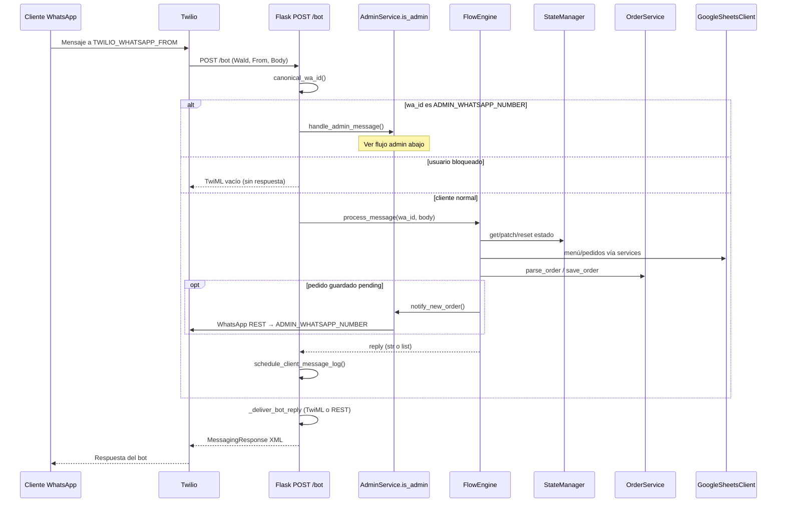
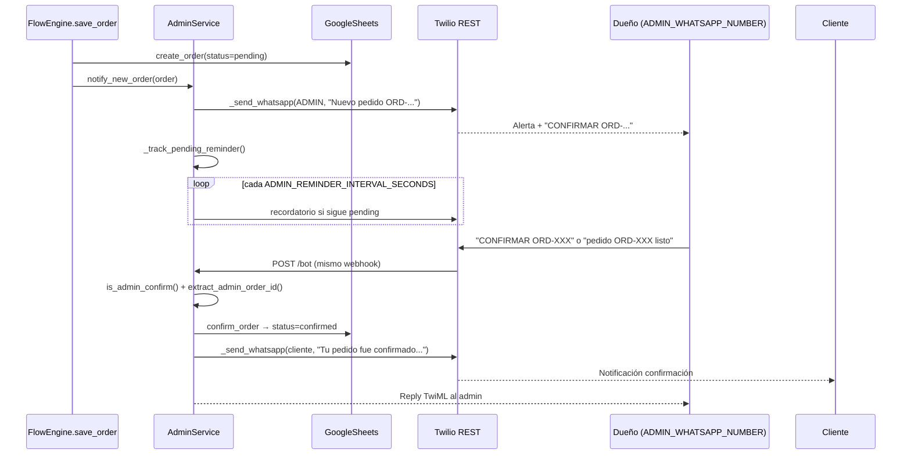
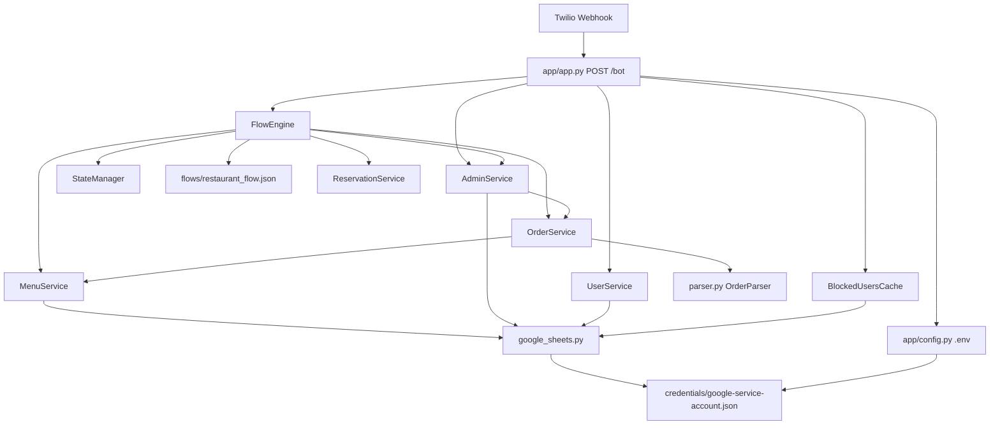

Aquí se irán pegando la respuesta de los prompts  de prompts_listos.md y cada versión será cada fase

## v0.0

## Verificación del proyecto WhatsBot

### 1. Código Python del bot
**Sí.** Hay un bot Flask en `app/` (webhook Twilio, parser, motor de flujo, servicios e integración con Google Sheets), más `run.py`, `runall.py` y scripts en `scripts/`. El núcleo está fuera de `venv/`.

### 2. Diez archivos clave
| # | Archivo | Rol |
|---|---------|-----|
| 1 | `app/app.py` | Flask + webhook `POST /bot` (Twilio WhatsApp) |
| 2 | `app/config.py` | Variables de entorno y rutas |
| 3 | `app/core/flow_engine.py` | Motor del flujo conversacional |
| 4 | `app/core/parser.py` | Parser NL de pedidos |
| 5 | `app/core/state_manager.py` | Estado por `WaId` |
| 6 | `app/integrations/google_sheets.py` | Google Sheets |
| 7 | `flows/restaurant_flow.json` | Flujo editable en JSON |
| 8 | `run.py` | Arranque del servidor (Waitress) |
| 9 | `requirements.txt` | Dependencias Python |
| 10 | `README.md` | Documentación de arquitectura e instalación |

### 3. Configuración y credenciales
| Recurso | ¿Existe? |
|---------|----------|
| `.env` | Sí |
| `.env.example` | Sí (plantilla) |
| JSON Google (service account) | Sí — `credentials/google-service-account.json` |

**Variables de entorno** (solo nombres, sin valores):

**Flask / servidor**
- `FLASK_ENV`
- `FLASK_DEBUG`
- `SECRET_KEY`
- `HOST`
- `PORT`

**Twilio / WhatsApp**
- `TWILIO_ACCOUNT_SID`
- `TWILIO_AUTH_TOKEN`
- `TWILIO_WHATSAPP_FROM`
- `TWILIO_REST_WEBHOOK_REPLIES`
- `ADMIN_WHATSAPP_NUMBER`

**Google Sheets**
- `GOOGLE_SHEETS_CREDENTIALS_PATH`
- `GOOGLE_SPREADSHEET_ID`
- `GOOGLE_SERVICE_ACCOUNT_JSON` (alternativa en nube; comentada en `.env.example`)

**Bot / caché / persistencia**
- `RESTAURANT_NAME`
- `STATE_PERSIST_PATH`
- `PARSER_ERROR_LOG_PATH`
- `MENU_CACHE_TTL_SECONDS`
- `ORDERS_CACHE_TTL_SECONDS`
- `BLOCKED_USERS_CACHE_TTL_SECONDS`
- `SHEETS_INCREMENTAL_THRESHOLD`
- `SHEETS_FULL_REFRESH_INTERVAL_SECONDS`
- `SHEETS_INCREMENTAL_BATCH_SIZE`

**Opcionales** (en `config.py` con defaults; no están en `.env.example`)
- `ADMIN_REMINDER_INTERVAL_SECONDS`
- `ADMIN_REMINDER_MAX_SECONDS`

**Scripts de despliegue** (opcionales)
- `DEPLOY_URL`
- `DEPLOY_TIMEOUT`

---

**Listo para Prompt 1 (Fase 0).**

#################################################
## v0.1 

# Fase 0 — Análisis (sin cambios en código)

Inventario completo del bot en la raíz. **No se creó `final_system/` ni se modificó ningún archivo.**

Recordatorio de producto: **WhatsBot = app Flutter móvil (UI tipo WhatsApp), no panel web.**

---

## 1. Tabla de archivos

| Archivo / carpeta | Propósito | ¿Chatbot? | Destino `final_system` | Acción |
|-------------------|-----------|-----------|------------------------|--------|
| `app/app.py` | Flask, webhook `POST /bot`, health, entrega TwiML/REST | **Sí** | `api/routes/whatsapp.py` + `chatbot/gateway.py` | Refactor Fase 2–4; no reescribir lógica |
| `app/config.py` | Carga `.env`, constantes Twilio/Sheets/caché | **Sí** | `config/settings.py` + `.env` | Migrar nombres; semilla defaults |
| `app/core/flow_engine.py` | Motor conversacional JSON | **Sí** | `chatbot/` (caja negra) | Copiar intacto vía gateway |
| `app/core/parser.py` | NL pedidos + `GLOBAL_COMMAND_INTENTS` | **Sí** | `chatbot/` | Copiar intacto |
| `app/core/state_manager.py` | Estado por `wa_id` + JSON disco | **Sí** | `chatbot/` → luego BD | Fase 5: persistir en PostgreSQL |
| `app/services/menu_service.py` | Menú (Sheets + caché) | **Sí** | `services/menu_service.py` | Multi-negocio + BD |
| `app/services/order_service.py` | Pedidos + parser carrito | **Sí** | `services/order_service.py` | Idem |
| `app/services/reservation_service.py` | Reservas | **Sí** | `services/` | Idem |
| `app/services/user_service.py` | Perfil cliente (Sheets) | **Sí** | `services/` | Idem |
| `app/services/admin_service.py` | Admin Twilio, confirmación, recordatorios | **Sí** | `services/notification_service.py` | Mantener legacy `ADMIN_WHATSAPP_NUMBER` |
| `app/services/blocked_users_cache.py` | Caché usuarios bloqueados | **Sí** | `services/` | Idem |
| `app/integrations/google_sheets.py` | Sheets + fallback demo + JSON local | **Sí** | `services/sheets_sync_service.py` | Opcional; no bloqueante |
| `app/utils/validators.py` | Confirmación admin, fechas, delivery | **Sí** | `chatbot/` | Copiar |
| `app/utils/client_message_log.py` | Log texto cliente/bot | **Sí** | `conversation_service` | Reemplazar por BD para Flutter |
| `flows/restaurant_flow.json` | Nodos, textos, `global_commands` | **Sí** | BD `business_config` + default en `config/` | Semilla al onboard; dueño edita en app |
| `run.py` | Entry producción Waitress | **Sí** | `api/main.py` (uvicorn) | Nuevo entry FastAPI |
| `runall.py` | Lanza servidor en CMD Windows | **Sí** | — | Solo dev legacy |
| `requirements.txt` | Deps Flask/Twilio/Sheets | **Sí** | `requirements.txt` ampliado | Añadir FastAPI, SQLAlchemy, JWT |
| `Dockerfile` | Imagen producción | **Sí** | `final_system/Dockerfile` | Actualizar para API |
| `railway.toml` / `render.yaml` | Deploy cloud | **Sí** | `final_system/` deploy | Migrar env vars |
| `.env` | Secrets runtime (*** configurado) | **Sí** | `final_system/.env` | Copiar valores reales Fase 1 (no en chat) |
| `.env.example` | Plantilla | **Sí** | `final_system/.env.example` | Ampliar con BD/JWT/API |
| `credentials/google-service-account.json` | Service account Google | **Sí** | Mismo path o `GOOGLE_SERVICE_ACCOUNT_JSON` | Copiar; gitignore |
| `data/*.json` | Cachés Sheets + `user_states.json` | Runtime | PostgreSQL + volúmenes | Migrar estado a BD |
| `data/parser_*.csv/md` | Benchmarks parser | No | `tests/` / `docs/` | Referencia QA |
| `scripts/*.py` | Stress, verify, diagnose | Parcial | `final_system/scripts/validate_*.py` | Reutilizar lógica de prueba |
| `client_messages_log/` | Logs manuales | No | — | Archivar; sustituir por BD |
| `README.md` | Doc + changelog masivo | No | `docs/` extractos | Referencia arquitectura |
| `PROMPT_*.md`, `PROMPTS_LISTOS.md` | Guías migración | No | — | Fuera del runtime |
| `AI_RULES.md`, `PRECIOS.md`, `pendientes.md`, `prompts.md` | Meta proyecto | No | — | No migrar |
| `guardar.py` | Git commit desde README | No | — | Ignorar |
| `dashboard/` (solo `__pycache__`) | Restos Django compilados | No | — | **No migrar** (sin fuente) |
| `venv/` | Entorno local | No | — | Ignorar |

---

## 2. Diagramas Mermaid

### Flujo cliente (webhook → respuesta)

### Flujo confirmación `ADMIN_WHATSAPP_NUMBER` (legacy)

---

## 3. Mapa de credenciales (sección 1.b)

Valores en disco verificados en `.env` y `credentials/`; en chat solo **\*\*\***.

| Variable legacy | Dónde está | Variable `final_system/.env` | Obligatoria | Estado legacy |
|-----------------|------------|------------------------------|-------------|---------------|
| `TWILIO_ACCOUNT_SID` | `.env`, `app/config.py`, `admin_service.py` | `TWILIO_ACCOUNT_SID` | **Sí** | Configurado *** |
| `TWILIO_AUTH_TOKEN` | `.env`, `app/config.py` | `TWILIO_AUTH_TOKEN` | **Sí** | Configurado *** |
| `TWILIO_WHATSAPP_FROM` | `.env`, `app/config.py` | `TWILIO_WHATSAPP_FROM` | **Sí** (línea bot clientes) | Configurado *** |
| `ADMIN_WHATSAPP_NUMBER` | `.env`, `app/config.py` | `ADMIN_WHATSAPP_NUMBER` | **Sí** (confirmación legacy) | Configurado *** |
| `TWILIO_REST_WEBHOOK_REPLIES` | `.env`, `app/app.py` | `TWILIO_REST_WEBHOOK_REPLIES` | Opcional (0=sandbox TwiML) | `0` |
| `GOOGLE_SHEETS_CREDENTIALS_PATH` | `.env`, `app/config.py` | `GOOGLE_SERVICE_ACCOUNT_JSON_PATH` | Opcional* | `credentials/google-service-account.json` |
| `GOOGLE_SERVICE_ACCOUNT_JSON` | `.env.example` (comentado), `google_sheets.py` | `GOOGLE_SERVICE_ACCOUNT_JSON` | Opcional (cloud) | No en `.env`; usa archivo |
| `GOOGLE_SPREADSHEET_ID` | `.env`, `app/config.py` | `GOOGLE_SHEET_ID_MENU` / unificar `GOOGLE_SPREADSHEET_ID` | Opcional* | Configurado *** |
| `RESTAURANT_NAME` | `.env`, `app/config.py` | Semilla `business.name` + default | Opcional | Configurado |
| `SECRET_KEY` | `.env` | `JWT_SECRET_KEY` (nuevo rol) | Opcional legacy; **Sí** SaaS | Placeholder |
| `FLASK_ENV` / `FLASK_DEBUG` | `.env` | `DEBUG` / eliminar | Opcional | development |
| `STATE_PERSIST_PATH` | `.env`, `app/config.py` | Reemplazado por BD | Legacy | `data/user_states.json` |
| `PARSER_ERROR_LOG_PATH` | `.env`, `app/config.py` | `PARSER_ERROR_LOG_PATH` o logs API | Opcional | Configurado |
| `MENU_CACHE_TTL_SECONDS` | `.env`, `app/config.py` | `MENU_CACHE_TTL_SECONDS` | Opcional | 60 |
| `ORDERS_CACHE_TTL_SECONDS` | `.env` | `ORDERS_CACHE_TTL_SECONDS` | Opcional | 30 |
| `BLOCKED_USERS_CACHE_TTL_SECONDS` | `.env` | Idem | Opcional | 15 |
| `SHEETS_INCREMENTAL_*` | `.env` | `config/sheets_config.py` | Opcional | Configurados |
| `ADMIN_REMINDER_INTERVAL_SECONDS` | `.env` (no en example) | Idem | Opcional | 300 |
| `ADMIN_REMINDER_MAX_SECONDS` | `.env` | Idem | Opcional | 3600 |
| `HOST` | `.env.example`, `run.py` | `HOST` | Opcional | Default `0.0.0.0` |
| `PORT` | `.env.example`, `run.py`, `Dockerfile` | `PORT` | Opcional | Default `5000` |
| `API_PUBLIC_URL` | **No existe**; README ngrok; `scripts` `DEPLOY_URL` | `API_PUBLIC_URL` | **Sí** para Flutter | Derivar: `https://<dominio>/` o ngrok `:5000` |
| `DEPLOY_URL` | `scripts/verify_deployment.py` | Alias documentación | Opcional dev | `http://127.0.0.1:5000` |
| `DATABASE_URL` | **No existe** | `postgresql://...` | **Sí** (nuevo SaaS) | Crear en Fase 1 |
| `REDIS_URL` | **No existe** | `redis://...` | Opcional | Crear si multi-instancia |
| `JWT_SECRET_KEY` | **No existe** | `JWT_SECRET_KEY` | **Sí** (WhatsBot app) | Generar Fase 1 |
| `JWT_EXPIRE_MINUTES` | **No existe** | `JWT_EXPIRE_MINUTES` | Opcional | Default 1440 |
| `GOOGLE_SHEETS_ENABLED` | **No existe** | `GOOGLE_SHEETS_ENABLED` | Opcional | `true` si hay spreadsheet |
| `CORS_ORIGINS` | **No existe** | `CORS_ORIGINS` | **Sí** para app móvil | `*` o dominios app |

\*Hoy Sheets + JSON local son fuente operativa; en SaaS pasan a espejo opcional (PostgreSQL = verdad).

**JWT / BD:** el bot legacy **no usa** base de datos ni JWT; todo es Flask + JSON + Google Sheets.

**OpenAI:** no referenciado en el código del bot.

**URL pública:** webhook Twilio = `POST {API_PUBLIC_URL}/bot` (README: ngrok `http 5000` → `https://<subdominio>.ngrok.io/bot`; producción Railway/Render).

---

## 4. Riesgos

| RIESGO | IMPACTO | MITIGACIÓN |
|--------|---------|------------|
| Reescribir `parser.py` / `flow_engine.py` | Regresión masiva en NL y flujos | Caja negra + `gateway.py`; copiar sin cambiar algoritmos (regla maestra #2) |
| Google Sheets como única fuente de verdad | Pérdida pedidos/menú si API Sheets cae | PostgreSQL fuente de verdad; `GOOGLE_SHEETS_ENABLED=false` debe funcionar |
| Estado en `data/user_states.json` | Sesiones rotas con 2+ instancias | Migrar a BD; volumen persistente en cloud |
| `ADMIN_WHATSAPP_NUMBER` = `TWILIO_WHATSAPP_FROM` | Admin nunca recibe comandos | Validación ya en `admin_service.py`; replicar en onboard |
| Twilio sandbox + `TWILIO_REST_WEBHOOK_REPLIES=0` | Producción con TwiML incorrecto | Detectar sandbox; documentar switch a REST |
| Secrets en repo / chat | Compromiso cuenta Twilio/Google | `.gitignore`; migrar a `final_system/.env`; rotar si expuestos |
| Confundir WhatsBot con dashboard web | Producto equivocado | Solo Flutter; `dashboard/` legacy ignorado |
| Webhook sin persistir mensajes | App Flutter vacía | Fase 4: guardar cada mensaje en `conversation`/`message` |
| Latencia sync Sheets en webhook | Timeouts Twilio | Mantener caché TTL; outbound admin ya síncrono en `notify_new_order` |
| Término `restaurant` en código/JSON | Deuda naming multi-negocio | Renombrar gradualmente a `business` en capa nueva |

---

## 5. Entry points

| Archivo | Función / ruta | Rol |
|---------|----------------|-----|
| `run.py` | `serve(app)` vía Waitress | **Producción principal** |
| `app/app.py` | `create_app()` → `app` | Factory Flask |
| `app/app.py` | `bot_webhook()` — `POST /bot` | **Webhook Twilio** |
| `app/app.py` | `health()` — `GET /health` | Healthcheck Railway/Render |
| `app/app.py` | `reload_flow()` — `POST /bot/reload-flow` | Hot-reload JSON flujo |
| `app/app.py` | `if __name__ == "__main__"` | Dev directo |
| `runall.py` | `run_server()` / `--serve` | Dev Windows |
| `Dockerfile` | `CMD ["python", "run.py"]` | Contenedor |
| `app/core/flow_engine.py` | `FlowEngine.process_message()` | Lógica conversacional cliente |
| `app/services/admin_service.py` | `handle_admin_message()` | Comandos dueño |
| `scripts/verify_deployment.py` | `main()` | Verificación deploy |
| `scripts/diagnose_twilio_whatsapp.py` | script | Diagnóstico Twilio |
| `scripts/simulate_conversation.py` | script | Simulación sin WhatsApp |

---

## 6. Ubicación de intents, textos, Twilio, Sheets

| Concern | Ubicación |
|---------|-----------|
| **Comandos globales (intents)** | `app/config.py` → `GLOBAL_COMMANDS`; `flows/restaurant_flow.json` → `meta.global_commands`; routing en `flow_engine._resolve_global_command()` |
| **Frases NL intents (menu/pedido/reservar/inicio/cancelar)** | `app/core/parser.py` → `GLOBAL_COMMAND_INTENTS`, `UserIntentClassifier`, `infer_user_intent()` |
| **Textos conversacionales (nodos)** | `flows/restaurant_flow.json` → `nodes.*.message`, `message_secondary`, `message_after_action`, `meta.cancel_message` |
| **Plantillas dinámicas** | `flow_engine._render()` + `RESTAURANT_NAME`, `NAV_HINT` en `app/config.py` |
| **Saludos / confirmación sí-no** | `app/utils/validators.py` → `GREETING_PHRASES`, `is_confirmation`, `is_admin_confirm` |
| **Twilio inbound** | `app/app.py` → `POST /bot` (form Twilio) |
| **Twilio outbound** | `app/services/admin_service.py` → `_send_whatsapp()` (REST Client); respuesta cliente vía TwiML o REST en `_deliver_bot_reply()` |
| **Google Sheets** | `app/integrations/google_sheets.py`; pestañas MENU/USERS/ORDERS/RESERVATIONS; credenciales path o `GOOGLE_SERVICE_ACCOUNT_JSON` |
| **Menú productos** | Sheets → caché `data/menu_cache.json` + `MenuService` |
| **Pedidos** | `OrderService` → `sheets.create_order` / `update_order_status` |

---

## 7. Grafo de dependencias (15 nodos clave)

---

## Hallazgos adicionales (Fase 0)

- **Stack:** Flask 3 + Waitress + Twilio + gspread; **sin** FastAPI, PostgreSQL, Redis, JWT, OpenAI.
- **Persistencia actual:** JSON en `data/` + Google Sheets; no hay ORM.
- **`dashboard/`:** solo bytecode; no hay fuente Django activo — **no es WhatsBot**.
- **`.env` real:** Twilio, Sheets y admin están poblados (valores **no** repetidos aquí).
- **Despliegue:** `Dockerfile`, `railway.toml`, `render.yaml` apuntan a `run.py` puerto **5000**, health `/health`.

---

¿Procedo con la **Fase 1** (scaffold `final_system/`, `.env` migrado desde legacy, sin tocar comportamiento del bot en raíz)? Responde **Sí** para continuar.

#################################################
## v0.2 